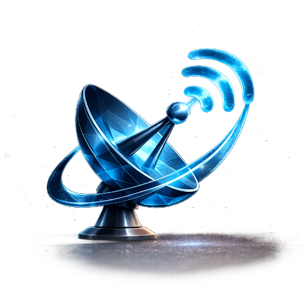

<p align="center">
  
</p>

<h1 align="center">TV Signal Solutions</h1>

<p align="center">
  <strong>Crystal-Clear Signal, Auckland-Wide</strong><br/>
  Premium marketing website for a 100% New Zealand-owned, family-run TV aerial, satellite, WiFi, 4G signal and CCTV business serving the greater Auckland region.
</p>

<p align="center">
  <a href="https://amirmasoudghorbani.github.io/Signal-Solution-Website/"><strong>View Live Site</strong></a>
</p>

<p align="center">
  
  
  
  
  
  
  
  
</p>

---

## Overview

TV Signal Solutions is a high-performance, single-page marketing website built with a cinematic deep-navy space aesthetic. The site is designed to convey technical expertise and premium quality through immersive visual storytelling, real-time canvas animations, and a polished, fully responsive interface.

The project prioritises zero-build-step simplicity: the entire front end ships as static files with no bundler, no framework CLI, and no compile step required.

---

## Features

### Interactive Particle-Morph Hero
A full-viewport HTML5 Canvas particle field composed of 11,000 individually animated particles. The system samples reference images (satellite dish, satellite, Auckland coverage map) and morphs between their point clouds on a timed cycle. Particles respond to cursor proximity with a physics-based repulsion model, creating an organic, reactive experience. Gracefully degrades to a CSS crossfade on devices that block pixel-reading.

### Animated Signal Background
A living atmospheric layer rendered on a secondary canvas behind the content sections. Includes a connectivity mesh of drifting nodes with dynamic link lines, transmitter nodes emitting expanding broadcast rings, data pulses flowing along links, oscilloscope-style radio-wave traces, and wireframe satellite and rocket illustrations drifting through the scene.

### 3D Liquid-Glass Service Carousel
A rotating cylinder of service cards built with React 18 and driven by `requestAnimationFrame` at 60fps. Features true liquid-glass aesthetics with refractive backdrop-filter blur, specular rim-lighting, travelling highlight animations, and volumetric depth via stacked card layers. Supports mouse/touch drag interaction with inertia damping and perspective-correct transforms using CSS `preserve-3d`.

### Animated Auckland Coverage Map
A canvas overlay on the service area map rendering a live radar sweep, expanding signal rings broadcasting from the Auckland hub, and pulsing signal beams. Suburb hotspots highlight on hover to reinforce local coverage.

### Recent Work Carousel
A horizontal photo gallery of completed installations with scroll-snap navigation, touch/swipe support, dot indicators, and arrow controls. Hovering triggers a subtle parallax zoom on images.

### AI Chat Assistant
An integrated live chat widget powered by an optional AI backend. Handles common service enquiries with context-aware responses. Falls back to a keyword-matching engine when no AI host is available, ensuring the chat always functions. Includes a lead-capture form for callback requests.

### Contact and Lead Capture
A fully validated quote request form with dual delivery: submissions are routed via FormSubmit for zero-backend email delivery, with an automatic `mailto:` fallback. The chat widget includes its own lead-capture flow for callback requests.

### Review Showcase
Auto-rotating testimonial cards displaying genuine Google reviews with a rating summary panel, star visualisation, and smooth crossfade transitions between testimonials.

---

## Tech Stack

| Layer | Technology |
|---|---|
| **Markup** | HTML5, semantic sections, Open Graph and Twitter Card meta |
| **Styling** | CSS3 custom properties design system, CSS Grid, Flexbox, `backdrop-filter`, `clamp()`, CSS animations and transitions |
| **Fonts** | Space Grotesk, Manrope, Space Mono (Google Fonts) |
| **Animation** | HTML5 Canvas 2D API, `requestAnimationFrame`, particle physics, easing functions |
| **UI Components** | React 18 (CDN, no build step), vanilla JS IIFEs |
| **Chat** | Custom AI chat client with keyword fallback engine |
| **Forms** | FormSubmit API with `mailto:` fallback |
| **Backend** | Node.js, Express 4, Nodemailer, express-rate-limit, CORS |
| **Deployment** | GitHub Actions CI/CD pipeline to GitHub Pages |
| **Brand Assets** | Custom SVG/PNG logo system, favicon, social share image |

---

## Project Structure

```
TV-Signal-Solutions/
├── index.html                  # Production page (links external CSS + inline JS)
├── index.src.html              # Source template with injection placeholders
├── styles.css                  # Design system and all component styles
├── assets/
│   ├── brand-mark.png          # Navigation and footer logo
│   ├── coverage.png            # Auckland coverage map image
│   ├── og-image.png            # Social share preview card
│   ├── favicon.svg             # Browser tab icon
│   └── work/                   # Recent installation photography
│       ├── antenna.jpg
│       ├── cctv.jpg
│       ├── ceiling.jpg
│       ├── diagnosis.jpg
│       ├── starlink.jpg
│       └── wall.jpg
├── hero.js                     # Particle-morph hero animation
├── background.js               # Animated signal background layer
├── coverage.js                 # Coverage map radar and signal overlay
├── carousel.jsx                # 3D liquid-glass service carousel (React)
├── work.js                     # Recent work photo carousel
├── reviews.js                  # Rotating Google reviews
├── chat.js                     # AI chat assistant with fallback
├── leads.js                    # Contact form and lead delivery logic
├── main.js                     # Navigation, scroll reveals, counters
├── image-slot.js               # Drag-and-drop image placeholder component
├── assets-data.js              # Base64 asset data for hero particle sampling
├── server/
│   ├── server.js               # Express contact form API
│   ├── package.json            # Server dependencies
│   └── .env.example            # Environment variable template
├── TV-Signal-Solutions-Brand/  # Full brand pack (logos, icons, social image)
├── .github/workflows/
│   └── deploy.yml              # GitHub Pages deployment pipeline
└── LICENSE
```

---

## Deployment

The site is fully static and deploys with zero build configuration.

**GitHub Pages** (configured via the included CI/CD pipeline):
1. Push to the `main` branch.
2. Navigate to **Settings > Pages** and set the source to **GitHub Actions**.
3. The site deploys automatically on every push.

**Alternative platforms** (Netlify, Vercel, Cloudflare Pages):
Connect the repository or drag-and-drop the project root. No build command is needed.

---

## Design System

The visual identity is built on a cohesive CSS custom properties design system:

- **Palette:** Deep navy space background (`#04070f`) with electric cyan accents (`#2ea3ff`, `#61d4ff`) and a violet developer accent (`#8b7bff`)
- **Typography:** Space Grotesk for display headings, Manrope for body text, Space Mono for monospace UI elements
- **Components:** Glass-morphism panels, gradient buttons with glow shadows, animated kicker eyebrows, reveal-on-scroll transitions
- **Responsive:** Fluid typography via `clamp()`, mobile-first grid breakpoints at 560px, 780px, 980px, and 1080px, with a compact mobile navigation dropdown

---

## License

Copyright &copy; 2026 TV Signal Solutions. All rights reserved. See [LICENSE](./LICENSE) for details.

Web and app development by [Amir](https://amirghorbani.dev).
